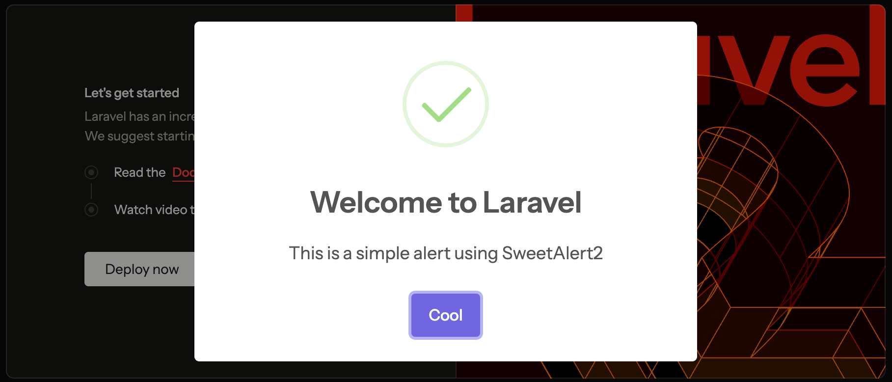

## Installation

```sh
composer require sweetalert2/laravel
```

Include the SweetAlert2 template in your layout file (usually `resources/views/layouts/app.blade.php`):

```blade
@include('sweetalert2::index')
```

## Usage

You can now run `Swal::fire()` anywhere in your Laravel application (controllers, middleware, etc.) to show a SweetAlert2 alert:

```php
use SweetAlert2\Laravel\Swal;

// same as `Swal.fire()` in JS, same options: https://sweetalert2.github.io/#configuration
Swal::fire([
    'title' => 'Laravel + SweetAlert2 = <3',
    'text' => 'This is a simple alert using SweetAlert2',
    'icon' => 'success',
    'confirmButtonText' => 'Cool'
]);

// or with a custom icon
Swal::success([
    'title' => 'Popup with a success icon',
]);
Swal::error([
    'title' => 'Popup with an error icon',
]);
Swal::warning([
    'title' => 'Popup with a warning icon',
]);
Swal::info([
    'title' => 'Popup with an info icon',
]);
Swal::question([
    'title' => 'Popup with a question icon',
]);

// or a toast
Swal::toast([
    'title' => 'Toast',
]);

// or a toast with a custom icon
Swal::toastSuccess([
    'title' => 'Toast with a success icon',
]);
Swal::toastError([
    'title' => 'Toast with an error icon',
]);
Swal::toastWarning([
    'title' => 'Toast with a warning icon',
]);
Swal::toastInfo([
    'title' => 'Toast with an info icon',
]);
Swal::toastQuestion([
    'title' => 'Toast with a question icon',
]);
```

The full list of options can be found in the [SweetAlert2 documentation](https://sweetalert2.github.io/#configuration).



## FAQ

### 1. What's the difference with [realrashid/sweet-alert](https://github.com/realrashid/sweet-alert) package?

The `realrashid/sweet-alert` package is too opinionated and too complex: facade, midddleware, adding vendor files, whatnot 🤯. And all that with 0 tests.

This package is simple, straightforward, and unopinionated. It's API is aimed to be as close as possible to the original [sweetalert2](https://sweetalert2.github.io/#configuration).

It simply provides a way to use SweetAlert2 in your Laravel application without touching JS or CSS files.

### 2. How it works?

Simple and straightforward:

- The `Swal::fire()` method will pass the options to the [flashed session](https://laravel.com/docs/12.x/session#flash-data).
- The blade partial template will check if there are any flashed session data and will render the SweetAlert2 popup.

### 3. Any limitations?

SweetAlert2 is a JavaScript package and some of its options are JS callbacks. It's not possible to use them in the `Swal::fire()` method.
If you need to use JS callbacks, you have to go to JS and use the SweetAlert2 API directly.
