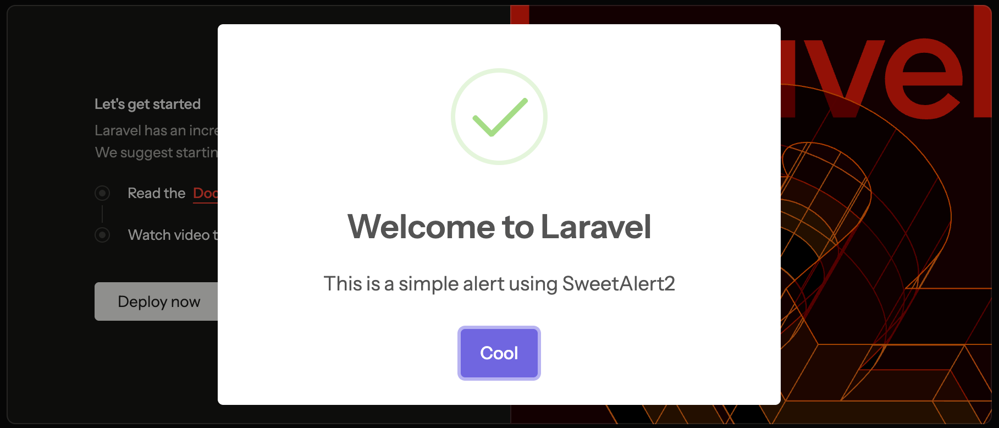

# Official SweetAlert2 integration for Laravel framework

### Demos: [Inertia + React](https://github.com/sweetalert2/sweetalert2-laravel-inertia-react-demo/) | [Livewire](https://github.com/sweetalert2/sweetalert2-laravel-livewire-demo)

# Installation

```sh
composer require sweetalert2/laravel
```

Include the SweetAlert2 template in your layout file (usually `resources/views/layouts/app.blade.php`):

```blade
@include('sweetalert2::index')
```

# Usage

## Laravel Controllers, Middleware, Views etc.

You can now call `Swal::fire()` or any of the available helper methods anywhere in your Laravel application (controllers, middleware, etc.) to show a SweetAlert2 alert:

```php
use SweetAlert2\Laravel\Swal;

// same as `Swal.fire()` in JS, same options: https://sweetalert2.github.io/#configuration
Swal::fire([
    'title' => 'Laravel + SweetAlert2 = <3',
    'text' => 'This is a simple alert using SweetAlert2',
    'icon' => 'success',
    'confirmButtonText' => 'Cool'
]);
```

The full list of options can be found in the [SweetAlert2 documentation](https://sweetalert2.github.io/#configuration).

### Helpers

Available Laravel helper methods:

```php
// with a custom icon
Swal::success([
    'title' => 'Popup with a success icon',
]);
Swal::error([
    'title' => 'Popup with an error icon',
]);
Swal::warning([
    'title' => 'Popup with a warning icon',
]);
Swal::info([
    'title' => 'Popup with an info icon',
]);
Swal::question([
    'title' => 'Popup with a question icon',
]);

// or a toast
Swal::toast([
    'title' => 'Toast',
]);

// or a toast with a custom icon
Swal::toastSuccess([
    'title' => 'Toast with a success icon',
]);
Swal::toastError([
    'title' => 'Toast with an error icon',
]);
Swal::toastWarning([
    'title' => 'Toast with a warning icon',
]);
Swal::toastInfo([
    'title' => 'Toast with an info icon',
]);
Swal::toastQuestion([
    'title' => 'Toast with a question icon',
]);
```

### Using JavaScript Callbacks

You can use JavaScript callbacks (like `didOpen`, `willClose`, etc.) by passing them as strings:

```php
// Toast with pause on hover
Swal::fire([
    'title' => 'Auto close alert',
    'toast' => true,
    'position' => 'top-end',
    'icon' => 'info',
    'showConfirmButton' => false,
    'timer' => 3000,
    'timerProgressBar' => true,
    'didOpen' => '(toast) => {
        toast.onmouseenter = Swal.stopTimer;
        toast.onmouseleave = Swal.resumeTimer;
    }',
]);
```

For more details on using callbacks, see [FAQ #4](#4-what-are-the-limitations).



## Livewire Components

You can now call `$this->swalFire` or any of the available helper methods in your Livewire component to show realtime popups and toasts:

#### LivewireExample.php

```php
use Livewire\Component;
use SweetAlert2\Laravel\Traits\WithSweetAlert;

class LivewireExample extends Component
{
    use WithSweetAlert;

    public function save(): void
    {
        // same as `Swal.fire()` in JS, same options: https://sweetalert2.github.io/#configuration
        $this->swalFire([
            'title' => 'Saved successfully!',
            'text' => 'The save method was called successfully!',
            'icon' => 'success',
            'confirmButtonText' => 'Lovely'
        ]);
    }
}
```

The full list of options can be found in the [SweetAlert2 documentation](https://sweetalert2.github.io/#configuration).

#### livewire-example.blade.php
```html
<div>
  <button type="button" wire:click="save">Save</button>
</div>
```

### Helpers

Available Livewire helper methods:

```php
// with a custom icon
$this->swalSuccess([
    'title' => 'Popup with a success icon',
]);
$this->swalError([
    'title' => 'Popup with an error icon',
]);
$this->swalWarning([
    'title' => 'Popup with a warning icon',
]);
$this->swalInfo([
    'title' => 'Popup with an info icon',
]);
$this->swalQuestion([
    'title' => 'Popup with a question icon',
]);

// or a toast
$this->swalToast([
    'title' => 'Toast',
]);

// or a toast with a custom icon
$this->swalToastSuccess([
    'title' => 'Toast with a success icon',
]);
$this->swalToastError([
    'title' => 'Toast with an error icon',
]);
$this->swalToastWarning([
    'title' => 'Toast with a warning icon',
]);
$this->swalToastInfo([
    'title' => 'Toast with an info icon',
]);
$this->swalToastQuestion([
    'title' => 'Toast with a question icon',
]);
```

### Using JavaScript Callbacks in Livewire

Just like in Laravel controllers, you can use JavaScript callbacks in Livewire components:

```php
$this->swalFire([
    'title' => 'Processing...',
    'toast' => true,
    'position' => 'top-end',
    'icon' => 'info',
    'timer' => 3000,
    'timerProgressBar' => true,
    'didOpen' => '(toast) => {
        toast.onmouseenter = Swal.stopTimer;
        toast.onmouseleave = Swal.resumeTimer;
    }',
]);
```

## Broadcasting (Reverb, Pusher, Ably)

You can use `Swal::broadcast()` or `Swal::broadcastPrivate()` to show real-time SweetAlert2 popups without a page reload, using [Laravel's broadcasting system](https://laravel.com/docs/broadcasting) (Reverb, Pusher, Ably, etc.).

This is ideal for backend actions that don't navigate away from the page, such as sending a password reset email from a dashboard, completing a background job, or any server-side event you want to surface to the user in real time.

### Setup

First, [configure Laravel broadcasting](https://laravel.com/docs/broadcasting#server-side-installation) in your application and install [Laravel Echo](https://laravel.com/docs/broadcasting#client-side-installation) on the frontend.

Then include the SweetAlert2 broadcast listener in your layout, specifying which channel to listen on:

```blade
{{-- Listen on a public channel --}}
@include('sweetalert2::broadcast', ['channel' => 'my-channel'])

{{-- Listen on a private channel (e.g. per-user notifications) --}}
@include('sweetalert2::broadcast', ['channel' => 'user.' . auth()->id(), 'private' => true])
```

The listener requires `window.Echo` (Laravel Echo) to be available on the page.

### Usage

#### Public channels

```php
use SweetAlert2\Laravel\Swal;

// same options as Swal::fire()
Swal::broadcast('my-channel', [
    'title' => 'Email sent!',
    'icon'  => 'success',
]);
```

#### Private channels

```php
use SweetAlert2\Laravel\Swal;

// Broadcast only to a specific user
Swal::broadcastPrivate('user.' . $user->id, [
    'title' => 'Your password reset email has been sent.',
    'icon'  => 'info',
]);
```

### Helpers

Available broadcasting helper methods for **public channels**:

```php
Swal::broadcastSuccess('my-channel', ['title' => 'Popup with a success icon']);
Swal::broadcastError('my-channel', ['title' => 'Popup with an error icon']);
Swal::broadcastWarning('my-channel', ['title' => 'Popup with a warning icon']);
Swal::broadcastInfo('my-channel', ['title' => 'Popup with an info icon']);
Swal::broadcastQuestion('my-channel', ['title' => 'Popup with a question icon']);

// or a toast
Swal::broadcastToast('my-channel', ['title' => 'Toast', 'icon' => 'success']);
Swal::broadcastToastSuccess('my-channel', ['title' => 'Toast with a success icon']);
Swal::broadcastToastError('my-channel', ['title' => 'Toast with an error icon']);
Swal::broadcastToastWarning('my-channel', ['title' => 'Toast with a warning icon']);
Swal::broadcastToastInfo('my-channel', ['title' => 'Toast with an info icon']);
Swal::broadcastToastQuestion('my-channel', ['title' => 'Toast with a question icon']);
```

Available broadcasting helper methods for **private channels**:

```php
Swal::broadcastPrivateSuccess('user.' . $id, ['title' => 'Popup with a success icon']);
Swal::broadcastPrivateError('user.' . $id, ['title' => 'Popup with an error icon']);
Swal::broadcastPrivateWarning('user.' . $id, ['title' => 'Popup with a warning icon']);
Swal::broadcastPrivateInfo('user.' . $id, ['title' => 'Popup with an info icon']);
Swal::broadcastPrivateQuestion('user.' . $id, ['title' => 'Popup with a question icon']);

// or a toast
Swal::broadcastPrivateToast('user.' . $id, ['title' => 'Toast', 'icon' => 'success']);
Swal::broadcastPrivateToastSuccess('user.' . $id, ['title' => 'Toast with a success icon']);
Swal::broadcastPrivateToastError('user.' . $id, ['title' => 'Toast with an error icon']);
Swal::broadcastPrivateToastWarning('user.' . $id, ['title' => 'Toast with a warning icon']);
Swal::broadcastPrivateToastInfo('user.' . $id, ['title' => 'Toast with an info icon']);
Swal::broadcastPrivateToastQuestion('user.' . $id, ['title' => 'Toast with a question icon']);
```

## Inertia.js

You can use `Swal::fire()` or any of the available helper methods in your Inertia.js controllers to show popups after navigation:

### Setup

First, add the SweetAlert2 flash data to your `HandleInertiaRequests` middleware:

```php
use SweetAlert2\Laravel\Swal;

public function share(Request $request): array
{
    return array_merge(parent::share($request), [
        'flash' => [
            Swal::SESSION_KEY => fn () => $request->session()->pull(Swal::SESSION_KEY),
        ],
    ]);
}
```

Then include the SweetAlert2 template in your Inertia app layout (usually `resources/views/app.blade.php` or similar):

```blade
@include('sweetalert2::index')
```

### Usage

#### InertiaController.php

```php
use SweetAlert2\Laravel\Swal;
use Inertia\Inertia;

class InertiaController extends Controller
{
    public function store()
    {
        // Your logic here...

        // Show SweetAlert2 popup after redirect
        Swal::success([
            'title' => 'Saved!',
            'text' => 'Your data has been saved successfully.',
        ]);

        return redirect()->route('dashboard');
    }
}
```

The full list of options can be found in the [SweetAlert2 documentation](https://sweetalert2.github.io/#configuration).

### Helpers

Available Inertia helper methods (same as Laravel helpers):

```php
// with a custom icon
Swal::success([
    'title' => 'Popup with a success icon',
]);
Swal::error([
    'title' => 'Popup with an error icon',
]);
Swal::warning([
    'title' => 'Popup with a warning icon',
]);
Swal::info([
    'title' => 'Popup with an info icon',
]);
Swal::question([
    'title' => 'Popup with a question icon',
]);

// or a toast
Swal::toast([
    'title' => 'Toast',
]);

// or a toast with a custom icon
Swal::toastSuccess([
    'title' => 'Toast with a success icon',
]);
Swal::toastError([
    'title' => 'Toast with an error icon',
]);
Swal::toastWarning([
    'title' => 'Toast with a warning icon',
]);
Swal::toastInfo([
    'title' => 'Toast with an info icon',
]);
Swal::toastQuestion([
    'title' => 'Toast with a question icon',
]);
```

# FAQ

## 1. How is this different to the [realrashid/sweet-alert](https://github.com/realrashid/sweet-alert) package?

The `realrashid/sweet-alert` package is too opinionated and too complex: facade, midddleware, adding vendor files, whatnot 🤯. And all that with 0 tests.

This package is simple, straightforward, and unopinionated. Its API is aimed to be as close as possible to the original [sweetalert2](https://sweetalert2.github.io/#configuration).

It simply provides a way to use SweetAlert2 in your Laravel, Livewire, or Inertia.js application without touching JS or CSS files.

## 2. How does it work?

Depending on whether you use the Swal class or the WithSweetAlert trait, within either a Laravel only, Livewire, or Inertia.js context, the behaviour is slightly different.

### Laravel controllers, middleware, views etc

1. The `Swal::fire()` method will pass the options to the session using `session()->put()`.
2. The blade partial template will check if there is any session data and will render the SweetAlert2 popup, removing the data with `session()->pull()` after displaying it.

### Livewire components

#### Realtime

1. The `$this->swalFire()` method will dispatch a [Livewire event](https://livewire.laravel.com/docs/events) with the options to the browser window within the current request.
2. The blade partial template will listen for the Livewire event and will render the SweetAlert2 popup.

This works on the first request and subsequent Livewire update requests.

#### First request or after redirect

1. The `Swal::fire()` method will pass the options to the session using `session()->put()`.
2. The blade partial template will show a popup on the initial page render, removing the data with `session()->pull()` after displaying it.

This works across multiple requests (including lazy-loaded components) until the alert is displayed.

This is ideal for showing messages after redirecting the user from a Livewire component, for example if they lack permissions to view a page:

```php
public function boot()
{
    if (Gate::denies('viewAny', Appointments::class)) {
        Swal::error([
            'title' => 'Unauthorized',
            'text' => 'You aren\'t authorized to view appointments!',
            'confirmButtonText' => 'Close'
        ]);
        return redirect()->route('index');
    }
}
```

### Inertia.js

1. The `Swal::fire()` method will pass the options to the session using `session()->put()`.
2. The `HandleInertiaRequests` middleware shares the session data with Inertia via shared props, removing it with `session()->pull()`.
3. The blade partial template listens for Inertia navigation events and renders the SweetAlert2 popup.

This works after Inertia page navigations (redirects, visits, etc.).

### Broadcasting (Reverb, Pusher, Ably)

1. The `Swal::broadcast()` or `Swal::broadcastPrivate()` method dispatches a `SweetAlert2BroadcastEvent` via Laravel's broadcasting system.
2. The broadcast listener partial (`@include('sweetalert2::broadcast', [...])`) uses Laravel Echo to subscribe to the specified channel and listens for the `sweetalert2-message` event.
3. When the event is received, the broadcast listener renders the SweetAlert2 popup in real time — no page reload required.

This works for any backend action that shouldn't navigate the user away from the current page.

## 3. How is the SweetAlert2 JavaScript library loaded?

This package uses a smart loading strategy for the SweetAlert2 library:

1. **Check for existing SweetAlert2**: If `window.Swal` is already available, it will use the existing import.

2. **Dynamic CDN loading**: If SweetAlert2 is not loaded, it will dynamically import it from the official CDN (`https://cdn.jsdelivr.net/npm/sweetalert2@11/dist/sweetalert2.esm.all.min.js`).

## 4. What are the limitations?

SweetAlert2 is a JavaScript package and some of its options are JS callbacks. While you can pass JavaScript callback functions as strings in the `Swal::fire()` or `$this->swalFire()` methods, keep in mind:

1. **Callbacks must be passed as strings**: Write your JavaScript function as a string. For example:

```php
Swal::fire([
    'title' => 'Toast notification',
    'toast' => true,
    'position' => 'top-end',
    'didOpen' => '(toast) => { toast.onmouseenter = Swal.stopTimer; toast.onmouseleave = Swal.resumeTimer; }',
]);
```

2. **Supported callback options**: The following callback options are supported and will be rendered as JavaScript functions:
   - `didOpen`
   - `didClose`
   - `didDestroy`
   - `willOpen`
   - `willClose`
   - `didRender`
   - `preDeny`
   - `preConfirm`
   - `inputValidator`
   - `inputOptions`

3. **Callback limitations**:
   - You cannot use PHP variables directly in callback strings (use JavaScript variables or values from the alert instead)
   - Complex logic should be kept in JavaScript files and called from the callbacks
   - For advanced use cases, consider using the SweetAlert2 API directly in JavaScript

4. **Security considerations**:
   - Callback strings are executed as JavaScript in the browser
   - **⚠️ CRITICAL: Only pass callback strings from trusted sources (your PHP backend code)**
   - **⚠️ NEVER pass user input directly as callback strings** to prevent XSS (Cross-Site Scripting) vulnerabilities
   - The package includes built-in XSS protection that escapes dangerous patterns in callbacks, but this is a defense-in-depth measure
   - Always validate and sanitize user input before including it in any SweetAlert2 options
   - If you need to include dynamic user-provided data, use regular options (like `title`, `text`, `html`) which are safely JSON-encoded
   - Example of unsafe usage (NEVER do this):
     ```php
     // ❌ UNSAFE - DO NOT DO THIS
     Swal::fire([
         'didOpen' => $_GET['callback'], // User input as callback = XSS vulnerability!
     ]);
     ```
   - Example of safe usage:
     ```php
     // ✅ SAFE - User data in regular options, callbacks from your code
     Swal::fire([
         'title' => htmlspecialchars($_GET['message']), // User input safely encoded
         'didOpen' => '(popup) => { console.log("Opened"); }', // Your trusted code
     ]);
     ```

### Example: Toast with Timer Control

```php
use SweetAlert2\Laravel\Swal;

Swal::fire([
    'title' => 'Your session will expire soon',
    'toast' => true,
    'position' => 'top-end',
    'icon' => 'warning',
    'showConfirmButton' => false,
    'timer' => 3000,
    'timerProgressBar' => true,
    'didOpen' => '(toast) => {
        toast.onmouseenter = Swal.stopTimer;
        toast.onmouseleave = Swal.resumeTimer;
    }',
]);
```

# Publishing to Packagist

This package is published to [Packagist](https://packagist.org/packages/sweetalert2/laravel) automatically via a [GitHub webhook](https://packagist.org/about#how-to-update-packages). When a new release is tagged on GitHub, Packagist is notified and updates the package index automatically.
